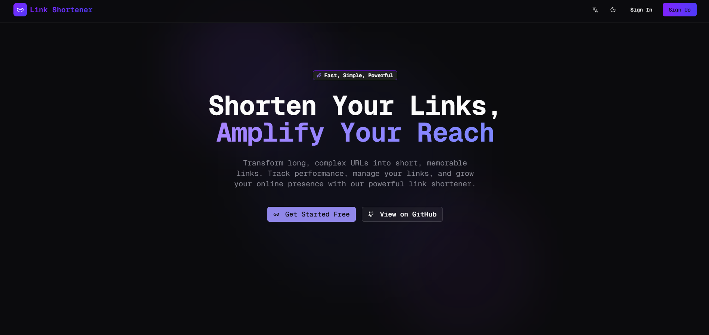
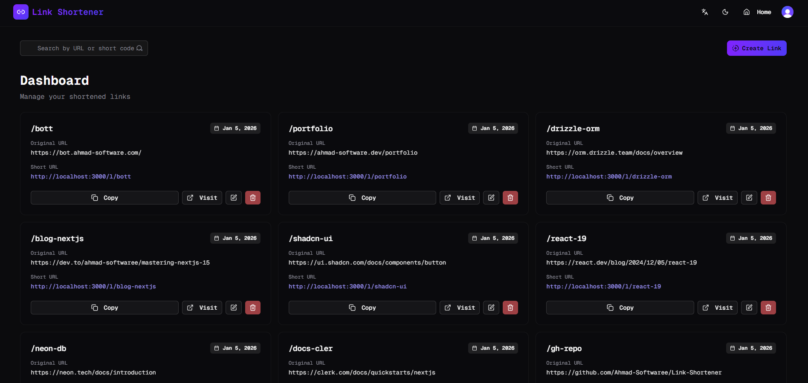

# 🔗 Link Shortener

A modern, full-stack link shortening application built with the latest web technologies. This project was created as a learning experience to explore and master modern web development tools and best practices.

## 📸 Screenshots

### Home Page



### Dashboard



## 🎯 Project Overview

This link shortener application allows users to transform long URLs into short, memorable links. Built with a focus on learning modern web development, this project incorporates authentication, database management, form handling, animations, and responsive design.

## ✨ Features

- **🔐 Authentication**: Secure user authentication with Clerk
- **🔗 Link Management**: Create, edit, and delete shortened links
- **📊 Dashboard**: Manage all your links in one place
- **🎨 Beautiful UI**: Modern design with shadcn/ui components
- **✨ Smooth Animations**: Framer Motion animations throughout
- **📱 Responsive**: Works seamlessly on all devices
- **🌙 Dark Mode**: Built-in theme support
- **⚡ Fast Performance**: Optimized with Next.js 16 features
- **🗄️ Type-Safe Database**: Drizzle ORM with PostgreSQL

## 🛠️ Tech Stack

### Frontend

- **[Next.js 16](https://nextjs.org/)** - React framework with App Router
- **[React 19](https://react.dev/)** - UI library
- **[TypeScript](https://www.typescriptlang.org/)** - Type safety
- **[Tailwind CSS 4](https://tailwindcss.com/)** - Utility-first CSS
- **[shadcn/ui](https://ui.shadcn.com/)** - UI components (New York style)
- **[Framer Motion](https://www.framer.com/motion/)** - Animations
- **[Lucide React](https://lucide.dev/)** - Icons

### Backend & Database

- **[Drizzle ORM](https://orm.drizzle.team/)** - Type-safe ORM
- **[PostgreSQL (Neon)](https://neon.tech/)** - Serverless database
- **[Next.js Server Actions](https://nextjs.org/docs/app/building-your-application/data-fetching/server-actions-and-mutations)** - Server-side data mutations

### Authentication

- **[Clerk](https://clerk.com/)** - Complete authentication solution

### Form Handling & Validation

- **[React Hook Form](https://react-hook-form.com/)** - Form management
- **[Zod](https://zod.dev/)** - Schema validation

### Development Tools

- **[Bun](https://bun.sh/)** - Fast JavaScript runtime
- **[ESLint](https://eslint.org/)** - Code linting
- **[Drizzle Kit](https://orm.drizzle.team/kit-docs/overview)** - Database migrations

## 🚀 Getting Started

### Prerequisites

- [Bun](https://bun.sh/) installed on your machine
- [PostgreSQL database](https://neon.tech/) (Neon recommended)
- [Clerk account](https://clerk.com/) for authentication

### Installation

1. **Clone the repository**

   ```bash
   git clone https://github.com/Ahmad-Softwaree/Link-Shortener.git
   cd Link-Shortener
   ```

2. **Install dependencies**

   ```bash
   bun install
   ```

3. **Set up environment variables**

   Create a `.env` file in the root directory:

   ```env
   # Database
   DATABASE_URL=your_postgresql_connection_string

   # Clerk Authentication
   NEXT_PUBLIC_CLERK_PUBLISHABLE_KEY=your_clerk_publishable_key
   CLERK_SECRET_KEY=your_clerk_secret_key

   # App URL (for shortened links)
   NEXT_PUBLIC_APP_URL=http://localhost:3000
   ```

4. **Run database migrations**

   ```bash
   bun run db:generate  # Generate migrations
   bun run db:migrate   # Apply migrations
   ```

5. **Start the development server**

   ```bash
   bun run dev
   ```

6. **Open your browser**

   Navigate to [http://localhost:3000](http://localhost:3000)

## 📁 Project Structure

```
├── actions/              # Server Actions
├── app/                  # Next.js App Router pages
│   ├── dashboard/        # Dashboard page
│   └── l/[code]/         # Short link redirect route
├── components/           # React components
│   ├── cards/            # Card components
│   ├── dashboard/        # Dashboard-specific components
│   ├── forms/            # Form components
│   ├── home/             # Home page sections
│   ├── shared/           # Shared components
│   └── ui/               # shadcn/ui components
├── db/                   # Database configuration
│   ├── index.ts          # Database client
│   └── schema.ts         # Drizzle schema
├── docs/                 # Project documentation
├── lib/                  # Utility functions
├── types/                # TypeScript types
│   └── validation/       # Zod schemas
└── public/               # Static assets
```

## 🗄️ Database Schema

The application uses a PostgreSQL database with the following schema:

```typescript
links {
  id: serial
  shortCode: string (unique)
  originalUrl: string
  userId: string
  createdAt: timestamp
  updatedAt: timestamp
}
```

## 📚 What I Learned

This project was built as a learning experience to explore and master:

- ✅ **Next.js 16 App Router** - Server Components, Server Actions, and modern routing
- ✅ **TypeScript** - Type safety across the entire application
- ✅ **Drizzle ORM** - Type-safe database operations
- ✅ **Clerk Authentication** - Modern auth patterns and user management
- ✅ **Form Handling** - react-hook-form with Zod validation
- ✅ **Component Architecture** - Modular and reusable component design
- ✅ **Animations** - Smooth UI transitions with Framer Motion
- ✅ **Tailwind CSS 4** - Utility-first styling and responsive design
- ✅ **shadcn/ui** - Building with pre-built accessible components
- ✅ **Server Actions** - Modern data fetching and mutations
- ✅ **Database Design** - Schema design and migrations with Drizzle

## 🎨 Features Breakdown

### Home Page

- Hero section with animated entry
- Feature showcase with scroll animations
- How it works section with improved visual design
- Statistics with animated counting numbers
- Call-to-action section
- Smooth scroll animations throughout

### Dashboard

- Authenticated user access only
- Create new shortened links
- View all your links in a grid layout
- Edit existing links
- Delete links with confirmation
- Copy short URLs to clipboard
- Staggered card animations
- Hover effects on interactive elements

### Link Management

- Form validation with Zod
- Real-time error handling
- Toast notifications for user feedback
- Responsive modal dialogs
- Type-safe form submissions

## 🔧 Available Scripts

```bash
# Development
bun run dev          # Start development server

# Build
bun run build        # Build for production
bun run start        # Start production server

# Linting
bun run lint         # Run ESLint

# Database
npx drizzle-kit generate  # Generate migrations
npx drizzle-kit migrate   # Run migrations
npx drizzle-kit studio    # Open Drizzle Studio
```

## 🚀 Deployment

This project can be deployed on [Vercel](https://vercel.com/) with zero configuration:

1. Push your code to GitHub
2. Import your repository on Vercel
3. Add your environment variables
4. Deploy!

## 📝 License

This project is open source and available for learning purposes.

## 🙏 Acknowledgments

- [Next.js](https://nextjs.org/) - The React Framework
- [Clerk](https://clerk.com/) - Authentication made easy
- [shadcn/ui](https://ui.shadcn.com/) - Beautiful UI components
- [Drizzle](https://orm.drizzle.team/) - Type-safe ORM
- [Neon](https://neon.tech/) - Serverless PostgreSQL

---

**Built with ❤️ as a learning project to explore modern web development**
